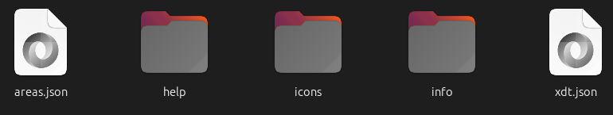

# FFInfoPacks

Do you need icons of items, monsters, NPCs, etc. for your FusionFall-related project? Have you ever needed to analyze the game data and relate everthing to everything by hand, but found that too time-consuming? Do you just want in-depth game information without a need to write any code? **FFInfoPacks** is for you!

This project is a collection of ZIP files that are released for every OpenFusion-based FusionFall version that contains just what you need!

## Download

Just go to the [releases page](https://github.com/FinnHornhoover/FFInfoPacks/releases) and download the ZIP file for the version you need from the latest release.

We also have Google Sheets for convenient spreadsheets that are generated by this project, separated by build per sheet. You can view the drive folder [here](https://drive.google.com/drive/folders/1LhYdMCUjOmiTGFwnJ4o8WGM2C2ZSyZq3?usp=sharing).

## Features

You will find the following stuff in the ZIP files:

**Area Info**: An area boundary JSON file for each build, that refers to game coordinates and area width and height values.

**Help Icons**: Help icons used in the help menu in the game.

**Item Icons**: Icons of items, monsters, NPCs, etc. neatly extracted from the game files of your build.

**Item Info**: Information about items, monsters, NPCs, etc. extracted and related to relevant data for you and your projects. We have detailed JSON files for every category below, as well as human-readable CSV files that you can open in Excel or Google Sheets to view. We also have an image depicting all the mission dependencies in the game!

**XDT JSON**: The XDT JSON file of your build containing almost all there is to know about the game data as-is.

## Caveats

- While mostly ironed out, there may be some inaccuracies with stuff in the `info` folder. Please report any issues to me here or on Discord.
- Retrobution data is included with permission from the Retrobution team. As such, the data you receive may have missing items, NPCs, etc. that are present in the game files but are not released yet. We will always try our best not to spoil the endeavors of Retrobution developers and maintainers, so we may hold off on releasing new info packs until after some time passes on updates.
- You should always verify the data yourself if it is critical to your project. Casual use of the data is always welcome.
